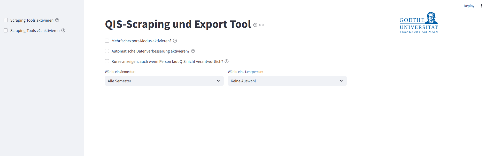
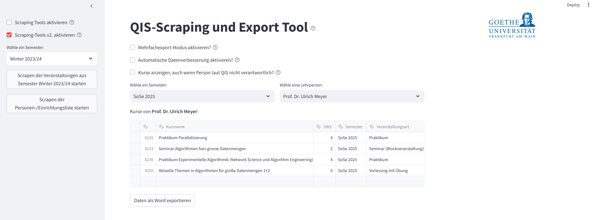

# Scraping QIS of Goethe University Frankfurt  

This project aims to provide a tool that automatically extracts lecture data from the course catalog of Goethe University Frankfurt on a semester-by-semester basis.  

The retrieved data is stored, converted into a DataFrame and can be exported as individual Word files for each lecturer. These Word files contain all courses and relevant course details assigned to the respective lecturer.  

Please note that the script operates on the following website:  
[QIS Goethe University Frankfurt](https://qis.server.uni-frankfurt.de/qisserver/rds?state=user&type=0&category=auth.redirect).  
If the website’s structure changes, adjustments—particularly in the `scraper.py` and `scraper_request_bf` scripts—may be necessary to ensure continued functionality.  

# Installation
**Clone project**
```bash
git clone https://github.com/Green1407/Scraping_QIS_Frankfurt
cd Scraping_QIS_Frankfurt
```

**Install dependencies**
```bash
pip install -r requirements.txt
```

**Run the project**
```bash
python main.py
```

Alternatively, simply download the complete project from the website, install the requierments and run the main. Please download all files in the repository, as both the database and the two “Beispiel” Word files are relevant.

# Example Use
1. After setup start the main.py, now Streamlit should open a website in your browser that looks like this:

 

2. Now you can either scrape new semesters via the section on the left or call up current data via the select box. In the example here, all course data for Prof. Dr. Ulrich Meyer is retrieved for the summer semester 2025 and output as a table, which can now be exported as Word via the button:

 

3. The export is then saved in the Word_Exports folder. An export was created here for the example and is located in this repository in the corresponding folder.

# Notes
All functions are also described in detail in the streamlit application.
The scraping process can take some time, the progress can be viewed via the console.
